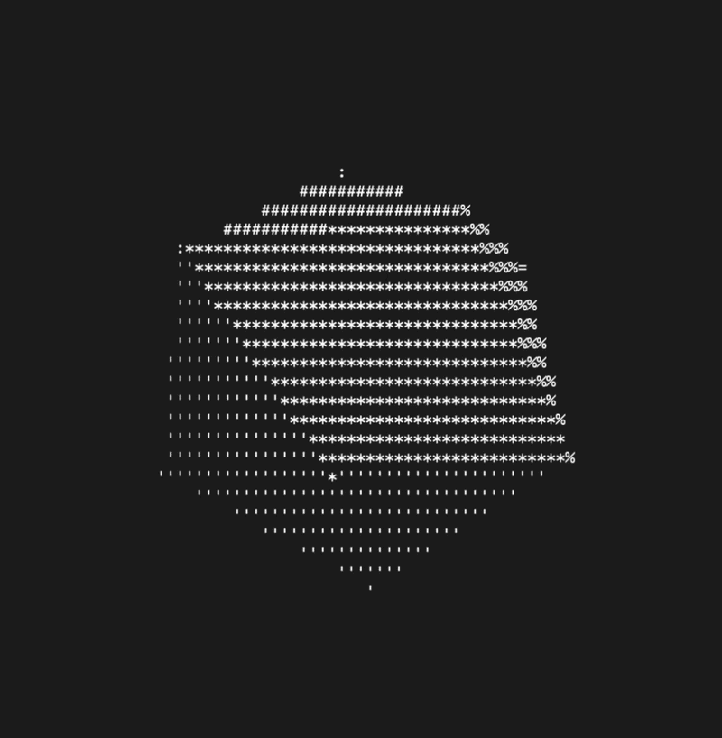

# ASCII 3D Software Renderer (Swift)

A minimal 3D software renderer written in Swift that renders shaded triangles directly in the terminal using ASCII characters.

This project implements core concepts from the graphics pipeline without relying on external graphics libraries.

## Demo



## Features

- Perspective projection (3D → 2D)
- Triangle rasterization using barycentric coordinates
- Z-buffer (depth testing)
- Directional lighting (dot product)
- ASCII shading based on light intensity

## How it works

### Projection

3D points are projected onto a 2D screen using a simple perspective projection:

x' = x * scale / (distance - z)  
y' = y * scale / (distance - z)

---

### Triangle Rasterization

Triangles are rasterized using barycentric coordinates computed via edge functions.

This allows:
- Efficient inside-triangle testing
- Interpolation of depth values

---

### Z-Buffer

Each pixel stores a depth value. A pixel is only drawn if it is closer to the camera than the previous value.

---

### Lighting

A directional light is applied using the dot product between the surface normal and light direction:

L = max(dot(normal, lightDir), 0)

The result is mapped to ASCII characters:

'.:-=+*#%@'

## Run

```bash
./build [cube|diamond|icosphere|pyramid]
./app
```

---

### What I learned

- How the graphics pipeline works at a low level
- Triangle rasterization and barycentric coordinates
- Depth buffering
- Basic lighting models
